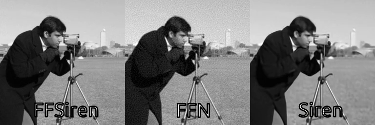
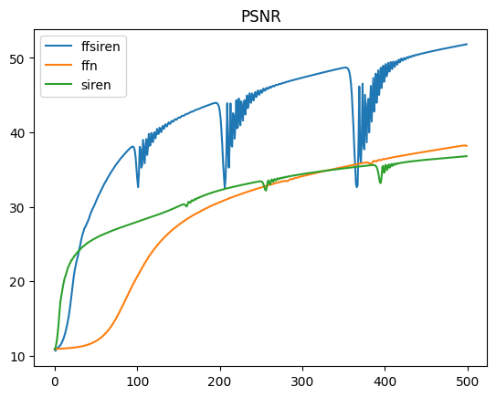
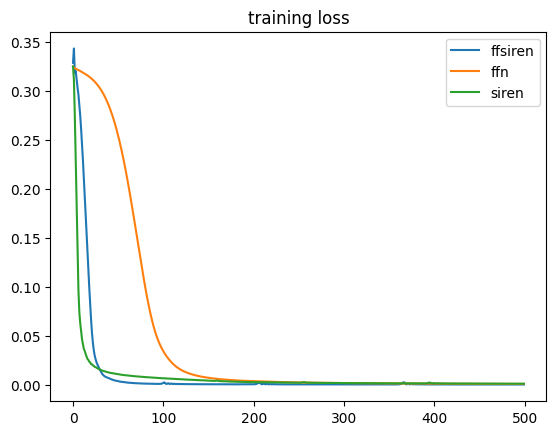

# FourierFeatureSiren
 

## Fourier Feature Network(FFN) VS Siren. Moreover, can we combine them?

This is an experiement to compare the performace of [Fourier Feature Network(FFN)](https://bmild.github.io/fourfeat/) and Siren MLP, proposed in work [Implicit Neural Activations with Periodic Activation Functions](https://vsitzmann.github.io/siren). In terms of accuracy in image fitting. 

In the end, a combined version **FourierFeatureSiren (FFSiren)** is presented, which outperforms both models.

* The Siren implementation is a copy-paste from the original implementation from the author.

* FFN implementation is a pytorch port from the original jax implemenation from the author.

* FFSiren is simply a combined version of the two. It takes the input embbeding using fourier feature mapping, and feed it into a Siren network.

## Image Fitting Demo
*Task*: Given the pixel coordinate (x,y) of the input camera_man (grayscale 256x256) image, predict the corresponding intensity of that pixel.

For fair comparision. All three models are having ~0.263 Million parameters, training with 500 steps and Adam optimizer with learning rate 1e-4.

## Results
|   |PSNR  | Pixel MSE  |  Gradient MSE |
|---|---|---|---|
|Siren   | 36.80  |0.0008   |  33.28 |
|FFN   | 38.43  | 0.00057  |  48.12 |
|**FFSiren**  | **51.83**  |**0.0000262**   | **18.12** |
* PSNR: higher the better; MSE: lower the better 

Peak signal-to-noise ratio          |  Mean squared error
:-------------------------:|:-------------------------:
  |  

|   |Pros  | Cons  |  
|---|---|---|
|**Siren**   | Converges very fast during training, it has smooth output as well as its gradient and laplacian |The output image is not sharp enough, high frequency signals are not recovered)  | 
|**Fourier Feature Network (FFN)**  | Has higher PSNR in the end than Siren, The image is sharper than Siren  |Converges the slowest during training, it also induce significantly more noise in the final image|  
|**Fourier Feature Siren (FFSiren)**  |Converges as fast as Siren during training, it has the highest PSNR, and has much less noise than FFN| Training loss has slight sparks which seems big in PSNR plot (due to log operation)  | 
